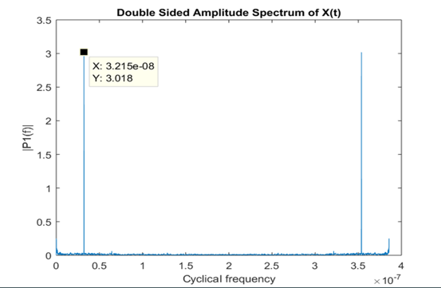
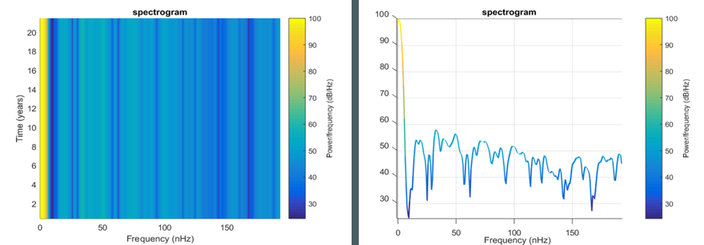
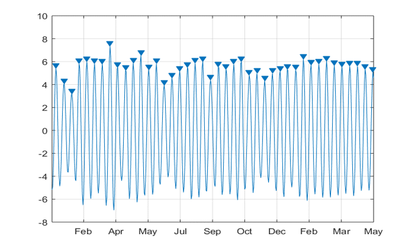

# A8--Pattern-Analysis-of-Earths-surface-Temperature(Matlab)

## Introduction:
> It is obvious that the global warming is evident, but is the earths surface temperature is also increasing? In this project, we analyze the 200 years of earth surface temperature to find if there exists any interesting phenomena between earths surface tiemperature and climate. 

## Objective:
* To find if the earths surface temperature is increasing with global warming
* To find if any trend or cyclicity exists in the surface temperature

## Methods used:
  1. Fast Fourier Transform
  2. Spectorgram
  3. Wavelets

[click here for full documentation](https://github.com/induraj2020/A8--Pattern-Analysis-of-Earths-surface-Temperature/blob/master/Signals%20project%20documentation.docx)
[click here for presentation](https://github.com/induraj2020/A8--Pattern-Analysis-of-Earths-surface-Temperature/blob/master/signals_final%20-%20Copy.pptx)

## Sample output
* Finding Cyclical repeatations in temperature using FFT
  
  

* using Spectogram
  
  

* Finding patterns in temperature
  
  
